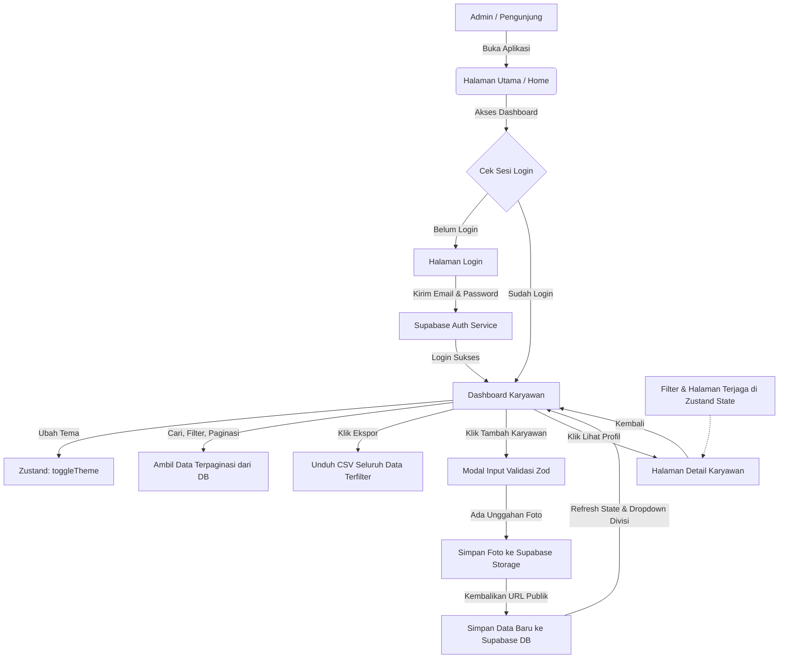

# 🚀 User Manager Pro


**User Manager Pro** adalah aplikasi manajemen karyawan skala perusahaan (*Enterprise-grade*) yang dirancang dengan fokus pada keamanan tingkat tinggi, pengalaman pengguna (UX) yang premium, serta performa optimal dalam menangani ribuan data. Aplikasi ini dibangun dengan perpaduan teknologi frontend modern dan database awan real-time.

---

## ✨ Fitur Utama

- **🛡️ Autentikasi Admin yang Aman**: Terintegrasi penuh dengan **Supabase Auth** untuk mengamankan data internal perusahaan.
- **☁️ Database Cloud Real-time**: Sinkronisasi data karyawan dan penyimpanan foto profil menggunakan kombinasi **Supabase Database** & **Supabase Storage**.
- **🔄 Filter Retention (UX Premium)**: Halaman aktif, kata kunci pencarian, dan filter divisi tetap terjaga secara global menggunakan **Zustand** meskipun admin berpindah rute (dashboard ⇄ detail profil).
- **🌗 Mode Gelap & Terang (Persist)**: Tampilan otomatis mendeteksi preferensi sistem pengguna atau diatur manual dengan retensi tema di penyimpanan lokal (*localStorage*).
- **✅ Validasi Formulir Ganda & Ketat**: Mencegah duplikasi email/ID karyawan langsung sebelum pengiriman data menggunakan **Zod Schema** dan **React Hook Form**.
- **📊 Ekspor Data Pintar**: Admin dapat mengunduh seluruh daftar karyawan terfilter secara rapi ke format CSV/Excel dengan penanganan enkapsulasi karakter khusus.

---

## 🛠️ Teknologi yang Digunakan

Aplikasi ini menggunakan perpaduan (*stack*) teknologi terbaik di industri:

| Kategori | Teknologi | Tujuan |
| :--- | :--- | :--- |
| **Framework** | [React 19](https://react.dev/) + [Vite](https://vitejs.dev/) | Rendering cepat dan proses development super instan. |
| **Styling** | [Tailwind CSS v3](https://tailwindcss.com/) | Kerangka kerja CSS berbasis utility untuk antarmuka modern & responsif. |
| **State Management** | [Zustand](https://github.com/pmndrs/zustand) | Manajemen state global yang ringan tanpa boilerplate rumit. |
| **Backend & Auth** | [Supabase](https://supabase.com/) | Database PostgreSQL, Storage Bucket untuk Avatar, dan API Autentikasi. |
| **Validasi Form** | [React Hook Form](https://react-hook-form.com/) + [Zod](https://zod.dev/) | Validasi form berkinerja tinggi berbasis skema deklaratif. |
| **Animasi** | [Framer Motion](https://www.framer.com/motion/) | Transisi halaman halus dan interaksi UI level premium. |
| **Routing** | [React Router v7](https://reactrouter.com/) | Sistem routing dan proteksi halaman SPA. |

---

## 🗺️ Alur & Arsitektur Aplikasi (Application Flow)

Aplikasi ini dirancang dengan alur data satu arah yang terpusat melalui Zustand Store agar komponen UI tetap sinkron tanpa menimbulkan lag.

### Diagram Alur Aplikasi


### Penjelasan Alur Kerja:

1. **Autentikasi (Sesi Persisten)**:
   Saat pertama kali dimuat, `App.jsx` memicu fungsi `initialize()` untuk memeriksa keberadaan sesi admin di penyimpanan browser. Jika terdeteksi, admin langsung diizinkan mengakses dashboard. Jika tidak, rute dashboard diproteksi dan diarahkan otomatis ke `/login`.
2. **Dashboard Karyawan**:
   Halaman dashboard mengambil data karyawan secara terpaginasi (10 data per halaman) berdasarkan kata kunci pencarian dan filter divisi yang aktif. Kueri data dilakukan langsung di sisi server Supabase untuk menjaga kecepatan muat data meskipun database berisi ribuan baris.
3. **Logika Ekspor CSV**:
   Ketika tombol **Export** ditekan, aplikasi memicu kueri khusus tanpa limitasi pagination, lalu merapikan kolom (ID Karyawan, Nama, Email, Divisi, dsb.) menjadi dokumen CSV ber-enkode UTF-8 dengan penanganan tanda kutip ganda agar aman dibaca oleh Microsoft Excel.
4. **Alur Tambah/Ubah Data**:
   Formulir input divalidasi secara real-time oleh Zod. Jika berkas foto profil dipilih, aplikasi mengunggahnya terlebih dahulu ke Supabase Storage bucket `avatars` untuk mendapatkan URL publiknya sebelum menyimpan data teks karyawan ke Supabase Database.
5. **Retensi Navigasi (Zustand)**:
   State pencarian, divisi terpilih, dan halaman aktif disimpan pada memori global Zustand. Ketika admin mengunjungi halaman detail profil karyawan lalu mengeklik tombol "Kembali", dashboard akan dimuat dalam keadaan persis seperti sebelum ditinggalkan.

---

## 🚀 Panduan Instalasi Lokal

Untuk menjalankan proyek ini secara lokal di komputer Anda, ikuti langkah-langkah berikut:

### 1. Kloning Repositori
```bash
git clone https://github.com/wisnu-wicaksana/user-manager-pro.git
cd user-manager-pro
```

### 2. Instal Dependensi
Pastikan komputer Anda sudah memiliki [Node.js](https://nodejs.org/).
```bash
npm install
```

### 3. Konfigurasi Environment Variable
Buat berkas baru bernama `.env` di root direktori proyek, lalu lengkapi isinya:
```env
VITE_SUPABASE_URL=URL_PROYEK_SUPABASE_ANDA
VITE_SUPABASE_ANON_KEY=KUNCI_ANON_SUPABASE_ANDA
```
*(Dapatkan kunci ini melalui panel Settings > API proyek Supabase Anda).*

### 4. Jalankan Aplikasi
```bash
npm run dev
```
Buka browser Anda pada alamat `http://localhost:5173`.

---

## 🔒 Setup Database Supabase (Penting)

Jalankan perintah SQL berikut di **SQL Editor** Supabase Anda untuk mempersiapkan tabel, relasi, dan kebijakan keamanan:

```sql
-- 1. Buat Tabel Karyawan
create table karyawan (
  id bigint primary key generated always as identity,
  custom_id text unique,
  name text not null,
  nickname text,
  email text unique not null,
  phone text,
  avatar text,
  divisi text,
  jabatan text,
  jalan text,
  kota text,
  created_at timestamp with time zone default timezone('utc'::text, now()) not null
);

-- 2. Aktifkan Row Level Security (RLS)
alter table karyawan enable row level security;

-- 3. Izinkan Hanya Admin Terautentikasi yang Memiliki Akses CRUD
create policy "Admin Full Access" on karyawan for all to authenticated using (true) with check (true);
```

### ⚠️ Rekomendasi Keamanan Penting:
Secara default, Supabase mengizinkan siapa saja melakukan pendaftaran akun baru melalui API publik. Demi mengamankan database karyawan internal Anda:
1. Buka Dashboard **Supabase**.
2. Masuk ke **Authentication** > **Providers** > **Email**.
3. **Nonaktifkan (OFF)** opsi **"Allow new users to sign up"**.
4. Pendaftaran admin baru kini hanya bisa dilakukan secara internal oleh Super Admin melalui panel kontrol Supabase.

---

## 📁 Struktur Folder Proyek

```text
src/
├── assets/         # Aset gambar statis
├── components/     # Komponen UI Reusable (Navbar, Card, Modal, Input)
├── lib/            # Inisialisasi library (Supabase Client)
├── pages/          # Halaman aplikasi (Home, Login, Users, UserDetail, Settings)
├── store/          # Zustand state manager (authStore, userStore)
├── App.jsx         # Entrypoint utama & Konfigurasi Routing
└── main.jsx        # Root rendering React
```

---

## 📄 Lisensi

Proyek ini berada di bawah lisensi [MIT](LICENSE). Anda diperbolehkan secara bebas untuk memodifikasi, mendistribusikan, dan memanfaatkannya untuk kepentingan pembelajaran maupun komersial.
